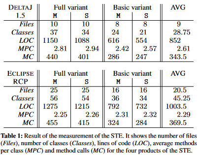
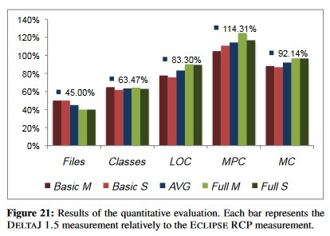

# DeltaJ / DeltaJava: an Eclipse-based delta-oriented programming language, designed to create Software Product Lines within the Java environment.
*What is difference between DeltaJ and DeltaJava?
- "DeltaJava" and "DeltaJ" are the same. DeltaJ uses a novel domain specific language (DSL) to specify the product line declarations, whereas DeltaJava is build upon DeltaEcore. It translates its delta modules to DeltaEcore delta modules of a special dialect and uses tools provided by DeltaEcore to specify product line feature models, constraints, as well as it's feature-to-delta mappings.
## Table of Contents
- [Installation](#installation)
- [Examples](#examples)
- [Summary of *DeltaJ 1.5: delta-oriented programming for Java 1.5*](#summary)

## Installation
To install new software to your Eclipse runtime, select "_Help_" and search for the "_Install new Software..._" entry. Copy the respective URL, add it as location and install the components you wish.

Use this update site to install DeltaJava to your Eclipse runtime, including all required plug-ins (DeltaEcore, JaMoPP and the EMFText common libraries).
```
https://deltajava.org/update/
```

**LEGACY WARNING**: If you run into problems with DeltaJava (e.g., references to Java classifiers are not resolved), please make sure to use an older Java version within your Eclipse runtime. We recommend to use Java 1.8 (JDK 8).
1. Install JDK 8 to your system.
2. Select "Window" -> "Preferences" -> "Java" -> "Installed JREs"
3. Click "Add...", select "Standard VM", and click "Next >"
4. Select the JDK 8 directory as the "JRE Home".
5. Select the newly-added JRE and click "Apply".
6. Go to "Java" -> "Compiler"
7. Set "Compiler compliance level" to 1.8.
8. Click "Apply and close".
When creating new projects for generated variants, make sure to select Java 1.8 as it's Execution environment JRE.
## Examples
### The "PaymentGateway" toy example
*note: this is a rewritten section of DeltaJava official page's [The "DeltaTalk" toy example](https://deltajava.org/#getting_started_toy_example)*

We provide an easy to grasp toy example to get started with DeltaJava; the very simple "PaymentGateway" CLI program. The project consists of a small collection of delta modules along with an even smaller base of core Java assets. To get an overview of the entire DeltaJava syntax and the possibilites it offers, please refer to the [syntax section](https://deltajava.org/#syntax).

1. On your Eclipse IDE, add the PaymentGateway project by selecting "File" -> "Open Projects from File System..."
2. In DeltaJava, all delta modules are contained inside a designated delta folder. For the "`com.priceside_drf.deltaj.paymentgateway`" project, this folder is simply named "_deltas/_". When applied, its contained delta modules add, modify and/or remove functionality of the project's source folder's core assets. In our particular PaymentGateway example, the core assets' source files implement a fairly simple CLI program. You can go ahead and start the project as Java application.
3. The PaymentGateway example works with DeltaEcore to organize its problem space artefacts which - for this project - are a feature model and delta mapping.
4. To generate variants from the PaymentGateway SPL, open its feature model ("_PaymentGateway.defeaturemodel_") with the "_Feature Model Configurator (DeltaEcore)_" editor: (Right click -> "Open With " -> "Feature Model Configurator (DeltaEcore)").
5. Using this editor, you can select (one or more) feature(s) generate variants accordingly by pressing the "_Generate Variant_" button.
6. A pop-up window will open and ask you to select a generator along with a directory to generate the variant in. Generally, we recommend you to generate variants into a designated eclipse project (e.g. "`com.priceside_drf.deltaj.paymentgateway.marketplace`").
7. Select the designated project's `/src` directory.
8. Pressing the OK button will trigger DeltaEcore's variant generation for your selected feature; respective delta modules will be applied. You can test your generated variant by starting the variant project as Java application.[](https://deltajava.org/#installation_update_site)

Feel free to change delta modules and play around with PaymentGateway to get a taste of how the variant generation works. For more information about DeltaEcore, visit [deltaecore.org](http://deltaecore.org/).

## Summary of *DeltaJ 1.5: delta-oriented programming for Java 1.5*
<a name="summary"></a>
DeltaJ 1.5 sepenuhnya mengintegrasikan fitur-fitur object-oriented Java. Ini mencakup delta operations yang ditingkatkan yang memungkinkan integrasi dengan sistem package Java, deklarasi dan modifikasi interfaces, perubahan pada inheritance hierarchy, akses ke *nested* dan *enum types*, serta penghapusan *overloaded methods* secara jelas. Selain itu, DeltaJ 1.5 memperkenalkan bahasa terpisah untuk menentukan product line declarations, meningkatkan kejelasan dan struktur deklarasi tersebut.

#### *Adds*
DeltaJ 1.5 berfokus pada adaptasi konstruksi Delta-oriented Programming (DOP) untuk mendukung fitur-fitur Java 1.5 secara penuh, karena konstruksi DeltaJ 1.1 tidak memadai untuk integrasi Java 1.5 secara menyeluruh. Poin-poin utamanya meliputi:

1. Mendukung operasi dasar DOP seperti menambah, memodifikasi, dan menghapus *class member*, serta panggilan `original(...)`.
2. Tantangan utama adalah mengintegrasikan sistem *package* Java dengan delta modules DOP.
3. Upaya awal untuk memasukkan deklarasi *package* dalam *delta modules* memiliki keterbatasan, seperti ketidakmampuan untuk memodifikasi atau menghapus deklarasi package dan pembatasan pada modularisasi kode.
4. Untuk mengatasi masalah ini, DeltaJ 1.5 merevisi operasi '*adds*' untuk menangani deklarasi *package* dan *import*.
5. Operasi '*adds*' yang baru di DeltaJ 1.5 memungkinkan penambahan *Java Compilation Units* secara lengkap, termasuk deklarasi package, daftar import, dan definisi tipe.
6. Pendekatan ini menyelesaikan masalah terkait manajemen package di berbagai delta modules dan memungkinkan organisasi kode yang lebih fleksibel.
7. DeltaJ 1.5 juga memperkenalkan dukungan untuk generic types dengan operasi '*adds*' yang baru.
###### *The new adds operation of DELTA J 1.5 holding the complete Java Compilation Unit:*
```
// Delta adding classes in separate packages
delta d1 {
    adds {
        package org.pkg1;
        class C1 {
            // Implementation details
        }
    }
    adds {
        import java.util.List;
        class org.pkg2.C2<T extends Number> implements List<Number> {
            // Implementation details
        }
    }
}
```

```
// Delta changing the package and import structure
delta d2 {
    modifies org.pkg2.C2 {
        modifies package com.pkg2;

        adds import java.util.MyList;
        removes import java.util.List;

        removes interfaces List<Number>;
        adds interfaces MyList;
    }
    removes org.pkg1.C1;
}
```

```
// Resulting variant
package spl.variante.org.pkg2;

import java.util.MyList;

class C2 implements MyList {
    // Implementation details
}
```

#### *Interfaces*
*Interfaces* dapat dideklarasikan dan ditambahkan dalam operasi 'adds' . Untuk dapat mengubah *interfaces*, diperkenalkan operasi modifikasi untuk *interfaces*. Dalam deklarasi *interface*, kita dapat menambah dan menghapus method yang dideklarasikan oleh sebuah *interface* serta konstanta-konstanta. Selain itu, kita dapat menambah dan menghapus *imports* serta *super-interfaces*.
```
// Modification of interface declarations
delta delta1 {
	modifies my.pkg.MyInterface {
		adds import my.other.pkg.MyList;
		removes import my.other.pkg.MyList2;
		adds interfaces MyInterface2;
		adds public static final int MY_INT_CONST = 3;
		adds int methodSignature1(...);
		removes methodSignature2(...);
	}
}
```
#### *Inheritance*
Java menyediakan *single inheritance* untuk memperluas fungsionalitas kelas dan *interfaces* untuk mengatasi keterbatasan *single inheritance*. DeltaJ 1.1 menggunakan keyword '*extending*' untuk memodifikasi *superclass*, namun memiliki keterbatasan dalam menangani *interfaces* dan *superclass*.

DeltaJ 1.5 memperkenalkan perubahan berikut:
1. Menghapus keyword '*extending*'.
2. Memperkenalkan keyword baru '*superclass*' yang dapat dikombinasikan dengan '*adds*', '*modifies*', dan '*removes*'.
3. Memperkenalkan keyword '*interfaces*' yang dapat dikombinasikan dengan 'adds*'* dan '*removes*'.

Perubahan ini memberikan kontrol lebih eksplisit untuk ekstensi superclass dan implementasi interfaces, menyatukan penggunaan operasi delta yang ada.
```
// DeltaJ 1.1
delta delta1 {
    adds class C1 { /* ... */ }
    adds class C2 extends C1 { /* ... */ }
    adds class C3 implements AnInterface { /* ... */ }
}

delta delta2 {
    modifies C1 extending C3 { /* ... */ }
    modifies C2 extending C3 { /* ... */ }
}

// DeltaJ 1.5
delta delta1 {
    modifies my.pkg.ClassName {
        adds superclass qualified.ClassName1;
        modifies superclass qualified.ClassName2;
        removes superclass;

        adds interfaces qualified.InterfaceName1, /* ... */;
        removes interfaces qualified.InterfaceName2, /* ... */;
    }
}
```
#### *Nested Types*
Java memungkinkan penggunaan *nested types*, di mana sebuah tipe dapat disarangkan dalam tipe lain. DeltaJ 1.1 tidak mampu menangani *nested types* dengan baik. Untuk mengatasi hal ini, DeltaJ 1.5 memperkenalkan ekstensi sintaks untuk *nested types*.

Perubahan utama meliputi:
1. Pengenalan keyword baru '*nested*' untuk mengidentifikasi nested type berdasarkan namanya.
2. Keyword '*nested*' dapat dikombinasikan dengan keyword yang sudah ada seperti '*adds*', '*modifies*', dan '*removes*'.
3. Sintaks untuk mendefinisikan dan memodifikasi *nested type* sama dengan sintaks untuk tipe biasa.

Ekstensi ini memungkinkan penanganan yang lebih fleksibel terhadap *nested types* dalam konteks *Delta-oriented Programming*.
```
delta delta1 {
    adds {
        class C1 {
            // ...
            public class Inner1 {
                // ...
            }
        }
    }
    modifies C2 {
        adds nested {
            public class Inner2 {
                // ...
            }
        }
        modifies nested Inner3 {
            // ...
        }
        removes nested Inner4;
    }
}
```

#### *Enumerations*
Java memungkinkan pendefinisian *enumeration types*, namun DeltaJ 1.1 tidak memiliki operasi untuk mengubah *enumeration type*. DeltaJ 1.5 memperkenalkan ekstensi sintaks untuk menangani *enumeration types* dalam konteks *Delta-oriented Programming*.

Perubahan utama meliputi:
1. Pengenalan keyword '*adds*' untuk menambahkan *item* ke *enumeration type*.
2. Pengenalan keyword '*removes*' untuk menghapus item dari *enumeration type*.
3. Tidak ada operasi '*modifies*' untuk item enumerasi, karena modifikasi daftar dapat dicapai dengan penambahan atau penghapusan item.

Ekstensi ini memungkinkan manipulasi yang lebih fleksibel terhadap *enumeration types* dalam *delta modules.*
```
delta delta0 {
    adds {
        public enum E { SEND, RECEIVE }
    }
}

delta delta1 {
    modifies E {
        removes SEND;
        adds ENCRYPTED, PLAIN;
    }
}
```
#### *Fields and Methods*
DeltaJ 1.5 memperkenalkan beberapa perubahan penting dalam penanganan *fields* dan *methods*:
1. *Fields*:
    - Menambahkan operasi '*modifies*' untuk *fields*, memungkinkan perubahan tipe dan *access modifiers* secara fleksibel.
    - Syntax baru memungkinkan modifikasi spesifik tanpa mengubah properti lain yang tidak disebutkan.
    - Mendukung perubahan pada generic types.
2. *Methods*:
    - Mempertahankan kemampuan untuk mengganti *method body* dan mengakses *body* asli dengan `original(...)`.
    - Tetapi, modifikasi properti *method* (*parameter*, *modifier*, *return type*) sedang dalam pengembangan.
3. *Overloading* dan Ambiguitas:
    - Mengatasi masalah ambiguitas dalam penghapusan method yang *overloaded* atau *fields* dengan nama yang sama dengan method.
    - Memperkenalkan syntax baru untuk penghapusan: `removes methodName(...)` untuk method dan `removes fieldName` untuk fields.
```
// Modifikasi Fields
delta delta1 {
    adds {
        class C1 {
            private int i, j;
            public static int k, l;
            private List<Number> list;
        }
    }
}

delta delta2 {
    modifies C1 {
        modifies i { public };
        modifies j { static };
        modifies k { !static final };
        modifies l { static !final Integer };
        modifies list { protected List<Integer> };
    }
}

// Penghapusan Fields dan Methods
delta delta1 {
    adds {
        class C1 {
            private int i, j, k;
            public void doSomething() { /* ... */ }
            public void doSomething(int i) { /* ... */ }
            public void doSomething(Number n) { /* ... */ }
        }
    }
}

delta delta2 {
    modifies C1 {
        removes i;
        removes k;
        removes doSomething();
        removes doSomething(int);
    }
}
```
### *Product Line Generation*
DeltaJ 1.5 memperkenalkan *domain specific language* (DSL) baru untuk menentukan *product line declaration*. Fitur utama meliputi:

1. Kemampuan untuk memisahkan spesifikasi *product line declaration* dalam file sumber terpisah.
2. DSL baru mencakup:
    - Set semua *features* dari *product line*
    - Set semua nama *delta* yang mengimplementasikan *features*
    - Set *constraints* yang menggambarkan konfigurasi valid dari *feature model*
    - Set *partitions* yang berisi pemetaan antara *deltas* dan *features*
    - Set semua *products* yang dapat dihasilkan dalam *product line*
3. *Feature model constraint* menggunakan operator propositional seperti AND, OR, XOR, NOT, dan IMPLIES.
4. *Partitions block* menggunakan `when` *clauses* untuk menentukan kombinasi *feature* mana yang mengaplikasikan *delta* tertentu.
5. *Products block* menentukan *set products* dari *product line*.
```
SPL EPL {
    Features = { Lit, Add, Neg, Print, Eval }
    Deltas = { DLitAddPrint, DNeg, DremAdd, DLitEval,
               DAddEval, DNegEval, DNegPrint, DOptionalPrint }
    Constraints {
        Lit & Print;
    }
    Partitions {
        { DLitAddPrint } when (Lit & Print),
        { DNeg } when (Neg);

        { DremAdd } when (!Add);

        { DLitEval } when (Eval),
        { DAddEval } when (Add & Eval),
        { DNegEval } when (Neg & Eval),
        { DNegPrint } when (Neg),
        { DOptionalPrint } when (Add & Neg);
    }
    Products {
        Basic = { Lit, Print };
        Full = { Lit, Add, Neg, Print, Eval };
    }
}
```
### *Product Generation*
DeltaJ 1.5 memperkenalkan proses baru untuk *product generation* berdasarkan plugin kedua yang mengimplementasikan *product line declaration*. Fitur utama meliputi:

1. Validasi feature model dan pemetaan delta ke kombinasi *feature*.
2. Generasi otomatis delta kosong jika tidak ditemukan dalam *source code*.
3. Informasi tentang *feature* atau *delta* yang tidak pernah digunakan.
4. Proses penentuan *delta* yang diperlukan untuk konfigurasi *feature* tertentu:
    - Membuat ekspresi Boolean dari konfigurasi *feature*.
    - Mengevaluasi `when`-*clause* menggunakan SAT *Solver*.
    - Menentukan delta yang harus diaplikasikan berdasarkan hasil evaluasi.
5. Proses generasi *source code*:
    - Transformasi *model-to-model* menggunakan EMF *meta-model*.
    - Ekstraksi implementasi delta yang diperlukan.
    - Aplikasi operasi delta pada model output.
    - Serialisasi kelas yang dihasilkan menjadi file *source* Java.
6. Kompilasi otomatis oleh Eclipse untuk file yang dihasilkan.

Contoh proses:
```
// Konfigurasi feature untuk EPL
MyEPL = Lit ^ !Add ^ Neg ^ Print ^ Eval

// Evaluasi when-clause
ToApply = MyEPL => W

// Jika ToApply dapat dipenuhi, delta terkait ditambahkan ke daftar yang akan diaplikasikan
```

### Evaluasi
Evaluasi DeltaJ 1.5 dilakukan melalui studi kasus yang membandingkannya dengan pendekatan berbasis plugin (Eclipse RCP). Dua pertanyaan penelitian utama:

1. RQ1: Apakah DeltaJ 1.5 cukup ekspresif untuk mengimplementasikan sistem perangkat lunak dunia nyata yang kaya varian?
2. RQ2: Apakah arsitektur sistem perangkat lunak kaya varian kurang redundan dan kode fitur lebih mudah diidentifikasi dibandingkan dengan pendekatan Eclipse RCP?

Studi kasus menggunakan [SimpleTextEditor SPL (STE)](https://www.tu-braunschweig.de/isf/research/deltas/example) yang terdiri dari 11 fitur dengan 128 varian valid. Implementasi dilakukan menggunakan DeltaJ 1.5 dan Eclipse RCP.



Hasil evaluasi:
1. DeltaJ 1.5 cukup ekspresif (RQ1) untuk mengimplementasikan sistem perangkat lunak dunia nyata yang kaya varian.
   - Menggunakan banyak konsep bahasa Java 1.5.
   - Integrasi mulus dengan konsep *delta-oriented*.
   - Mudah mengadopsi implementasi yang ada tanpa *overhead* implementasi.
   
2. Kode sumber DeltaJ 1.5 kurang redundan (RQ2):
   - Membutuhkan lebih sedikit file (45%) dibandingkan Eclipse RCP.
   - Mengimplementasikan lebih sedikit kelas (63.47%) dengan fungsionalitas yang sama.
   - Basis kode lebih kecil (rata-rata 83.3%), terutama untuk varian yang tidak menggunakan semua fitur.
   - Desain lebih intuitif tanpa *overhead* *interface* dan kode *boilerplate*.
   

Keterbatasan studi:
- Hanya menggunakan satu sistem kecil, hasil tidak dapat digeneralisasi.
- Hanya membandingkan dengan satu pendekatan lain (Eclipse RCP).
- Analisis dilakukan pada varian konkret, bukan keseluruhan basis kode.

Studi ini menunjukkan bahwa DeltaJ 1.5 menawarkan pendekatan yang lebih fleksibel dan kurang redundan untuk mengimplementasikan sistem perangkat lunak yang kaya varian dibandingkan dengan Eclipse RCP.

## Daftar Pustaka
[1] Koscielny et al. (2014). DeltaJ 1.5: delta-oriented programming for Java 1.5. In Proceedings of the 2014 International Conference on Principles and Practices of Programming
[2] DeltaJ website. https://deltajava.org/
[3] TU Braunschweig - Delta Research. https://www.tu-braunschweig.de/isf/research/deltas
